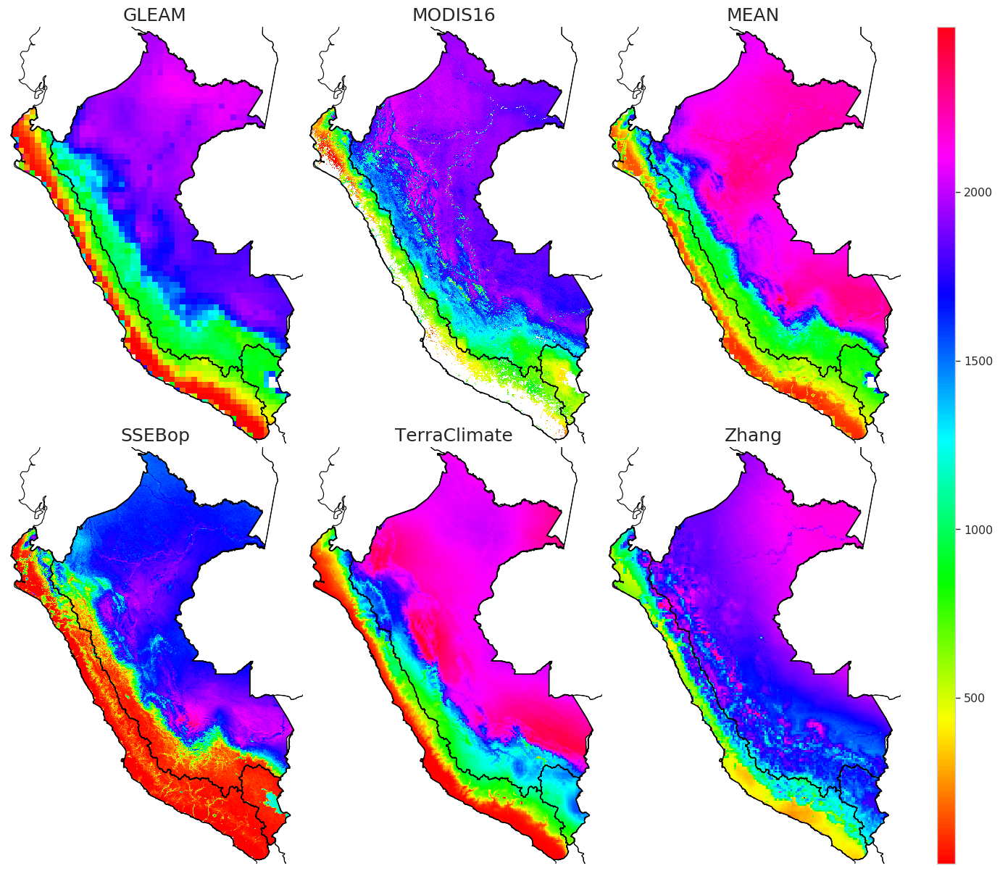

prob_Budyko (probabilistic Budyko)
==================================

The main goal of this work was to evaluate the vulnerability of water availability due to climate change using the
probabilistic Budyko under a bottom-up approach. It follows the ideas of two main research papers: to validate actual
evapotranspiration products (`Weerasinghe et al. 2020 <https://www.hydrol-earth-syst-sci.net/24/1565/2020/hess-24-1565-2020.html>`__) and to apply the probabilistic Budyko (`Singh and Kumar 2015 <https://agupubs.onlinelibrary.wiley.com/doi/full/10.1002/2015GL066363>`__).

.. class:: center
Annual real evaporation climatology based on remote sensing and reanalysis (2003-2013).

References
------------
1. Huerta , A. (2020). Vulnerabilidad de la disponibilidad de los recursos hídricos en el Perú frente al cambio climático: análisis probabilístico de" Budyko". Universidad Nacional Agraria La Molina. http://repositorio.lamolina.edu.pe/handle/UNALM/4503
2. Huerta, A. (2020). Actual evapotranspiration at Peru scale (2003-2013) (Version 1). figshare. https://doi.org/10.6084/m9.figshare.13270391.v1 (http://repositorio.lamolina.edu.pe/handle/UNALM/4503)